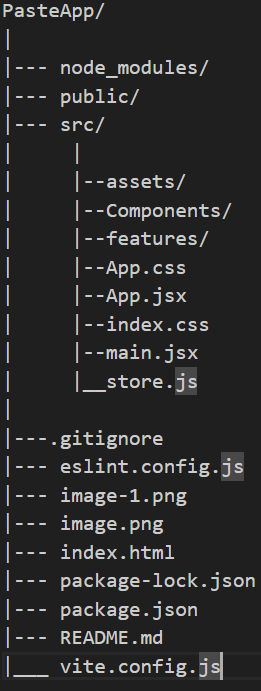
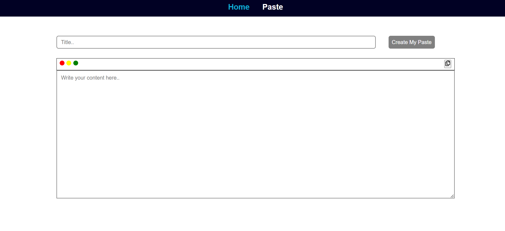
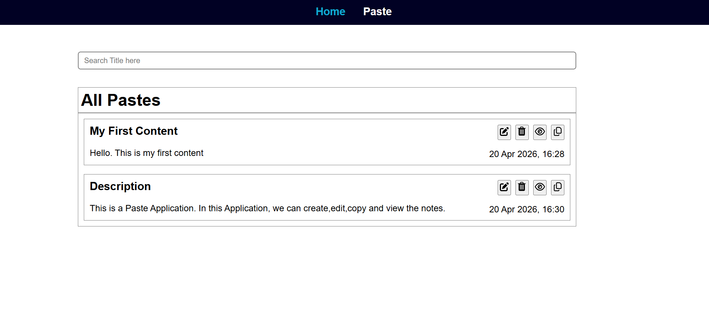

📝 PasteApp 
A simple, fast, and local-first web application to create, store, and manage your text snippets or code pastes.
🚀 Features
Create & Update: Easily create new pastes or update existing ones with a dynamic UI.
Duplicate Prevention: Built-in logic to prevent creating pastes with duplicate titles.
Smart UI: Action buttons automatically enable/disable based on input validation.
Local Persistence: All your pastes are saved to localStorage, so they persist even after a page refresh.
Formatted Dates: Every paste is timestamped and displayed in a human-readable format.
Searchable: Quickly find your pastes by title.

🛠️ Tech Stack
Frontend: React.js
State Management: Redux Toolkit (RTK)
Styling: Plain CSS
Notifications: React Hot Toast (for success/error feedback)
Icons: React Icons/SVG images

📦 Installation & Setup
1.Clone the repository
git clone https://github.com/NavyaPagadala99/Notes-Paste-Application.git

2.Install dependencies
cd PasteApp
npm install

3.Run the development server
npm run dev

Folder Structure:

🖥️ Usage
Creating a Paste: Enter a title and your content. The "Create" button will enable once both fields are filled.
Editing: Click on the edit icon of any paste to load it back into the editor.
Deleting: Remove unwanted snippets with a single click (includes a toast confirmation).
Copying: Built-in "Copy to Clipboard" feature for quick sharing.

📄 Code Highlights
Duplicate Title Check
const alreadyExists = state.pastes.some((p) => p.title === paste.title);
if (alreadyExists) {
  toast.error("Paste with same title already exists");
  return;
}
Dynamic Button State
<button disabled={!title || !content}>
  {pasteId ? "Update Paste" : "Create Paste"}
</button>

